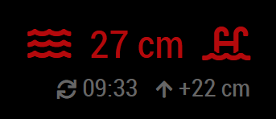

# MMM-SmartWater

This is a module for the [MagicMirror²](https://github.com/MichMich/MagicMirror/) to display water level values from a remote sensor that is capable to POST the measured values through HTTP protocol. It is designed to be generic and tested to work together with the open-source [SmartWater](https://github.com/balassy/smartwater) sensor hardware.

## Features

By default this module displays the measured water level, the change from the previous reading, an icon and the time of the last update:


When the water level reaches a threshold the module displays the measured value highlighted with yellow:


When the water level continues rising the module adds an alert icon:



You can configure the module to display a custom icon:


You can also hide the second line:


This module is capable to display only a single water level value. If you would like to see the value of more sensors on your mirror, add this module multiple times.

For updates, please check the [CHANGELOG](https://github.com/balassy/MMM-SMartWater/blob/main/CHANGELOG.md).

## Using the module

To use this module follow these steps:

1. Switch to the `modules` folder of your MagicMirror

```bash
cd ~/MagicMirror/modules/
```

2. Clone this repository to the `modules` folder

```bash
git clone https://github.com/balassy/MMM-SmartWater.git
```

3. Switch to the `MMM-SmartWater` folder

```bash
cd ./MMM-SmartWater/
```

4. Install the 3rd party dependencies

```bash
npm install
```

5. Add the following configuration block to the modules array in the `config/config.js` file:

```js
var config = {
  modules: [
    {
      module: 'MMM-SmartWater',
      position: 'top_right',
      config: {
        sensorId: null,
        icon: 'water',
        showMore: true,
        minOkDistanceInCm: 50,
        minWarningDistanceInCm: 30
      }
    }
  ]
}
```

**!! IMPORTANT !!**

For security reasons the MagicMirror is *not* reachable externally, which also means that it does not accept data from external sources. Make sure you configure the `ipWhitelist` setting in the `config.js` file (see [these lines in the sample config](https://github.com/MichMich/MagicMirror/blob/master/config/config.js.sample#L18-L22)) correctly, so the remote sensor can communicate with your mirror.

## Configuration options

| Option     | Description
|------------|-----------
| `sensorId` | **REQUIRED** An arbitrary value that determines from which sensor this module accepts updates. It can also be used as an API key to restrict access to your mirror.<br><br> **Type:** `string` <br>**Default value:** `null` (must be configured)
| `icon`     | *Optional* Name of a [FontAwesome icon](https://fontawesome.com/icons?d=gallery) that is displayed before the water level value. You can set it to `null` to not display any symbol. <br><br> **Type:** `string` <br>**Default value:** `'water'`
| `showMore` | *Optional* Determines whether a second line with additional data (e.g. timestamp of the last data update and battery level) should be displayed on the mirror. <br><br> **Type:** `boolean` <br>**Default value:** `true`
| `minOkDistanceInCm`      | *Optional* The threshold above which the water level is considered normal.<br><br> **Type:** `Number` <br>**Default value:** `50`
| `minWarningDistanceInCm`      | *Optional* The threshold above which the module should switch to warning state.<br><br> **Type:** `Number` <br>**Default value:** `30`

## How it works

This module creates a new HTTP endpoint on the mirror's webserver, which handles HTTP POST requests sent by the remote sensors. The HTTP request must contain the water level data measured by the sensor and the unique identifier you assigned to the sensor. The module displays the measured value only if the configured `sensorId` matches the value received in the request.

It is up to the sensor to define how often it updates the measured data, the mirror will display the last received value.

## Sensor requirements and communication

This module can work with any sensor that is capable to periodically send HTTP POST requests with the following standard JSON body to the `http://<your mirror's IP>:8080/smart-water` endpoint:

```javascript
{
  "distanceInCm": 27,
  "sensorId": "1"
}
```

The `distanceInCm` property value is optional, must be a `number`, and must contain the measured water level in centimeter. It will be displayed on the mirror as is, without any conversion, appended by the `cm` symbol.

The `sensorId` property must be a `string`, and can contain any value, but it is important that it must match the `sensorId` specified for the module in the configuration. It is used to determine which module should display the value, if the module is added multiple times to the mirror. It can also be used as an API key to ensure that only authorized sensors can update the mirror.

Make sure that your sensor properly sets the `Content-Type` header in the HTTP request to `application/json`, otherwise the module will not be able to parse the request body.

## Recommended hardware

The recommended and tested hardware sensor for this module is [SmartWater](https://github.com/balassy/smartwater). Both the hardware and the software of SmartWater is open-source, and can be built as a DIY project. SmartWater has built-in support for this MMM-SmartWater module, and can push measured data also to other popular services, like ThingSpeak.

## Localization

Currently this module supports English (`en`) and Hungarian (`hu`) languages. The language can be specified in the global `language` setting in the `config.js` file.

Want to see more languages? Please contribute!

## Contribution

If you would like to contribute to the codebase, please use the preconfigured linters to analyze the source code before sending a pull request. To run the linters follow these steps:

1. Install developer dependencies:

```bash
npm install
```

2. Run all linters:

```bash
npm run lint
```

## Got feedback?

Your feedback is more than welcome, please send your suggestions, feature requests or bug reports as [GitHub issues](https://github.com/balassy/MMM-SmartWater/issues).

## Acknowledments

Many thanks to [Michael Teeuw](https://github.com/MichMich) for creating and maintaining the [MagicMirror²](https://github.com/MichMich/MagicMirror/) project fully open source.

## About the author

This project is created and maintained by [György Balássy](https://www.linkedin.com/in/balassy).
